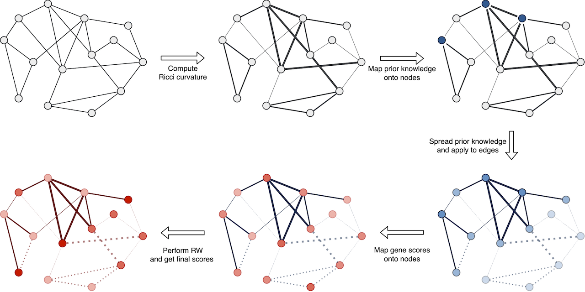

# PWN: Prioritization with a Warped Network



[](https://bmcbioinformatics.biomedcentral.com/articles/10.1186/s12859-023-05227-x)
[](LICENSE)

## Installation

```bash
> pip install git+https://github.com/Standigm/PWN
```

## Experiments

Notice that all experiment scripts and results are located under [`./experiments`](experiments).
Following section explains how to reproduce the results.

### Collect Experiments Results

```bash
> pip install "pwn[experiment] @ git+https://github.com/Standigm/PWN"  # additional requirements
> python run.py
```

### Visualize

To generate figures, install [R](https://www.r-project.org) and run the following commands:

```bash
> Rscript -e 'chooseCRANmirror(ind=1); install.packages("tidyverse")'  # requirements
> Rscript figure.R
```

## License

The source code is distributed under [BSD 3-Clause Clear License](LICENSE), while each data used in experiments is
distributed under different licenses.

Please use the following command for license information of other software used in this project:

```bash
> poetry show --only main | grep -E -o '^[^ ]+' | xargs pip-licenses -o license -p
```
